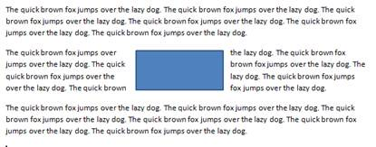
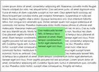
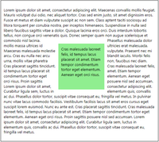
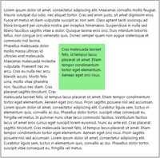
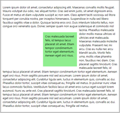
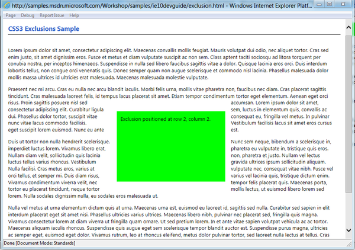
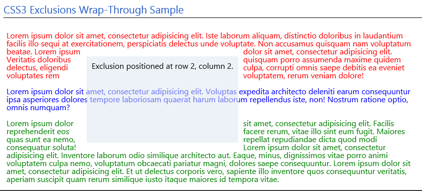

# CSS Exclusions

[CSS Exclusions](https://msdn.microsoft.com/library/hh772711?f=255&MSPPError=-2147217396) define how inline content flow around elements, extending the content wrapping ability of floats to any block-level element. CSS Exclusions include the following properties:

Property | Description
:------------ | :------------- 
[-ms-wrap-flow](https://msdn.microsoft.com/library/hh772045.aspx) | Gets or sets a value that specifies how exclusions impact inline content within block-level elements.
[-ms-wrap-margin](https://msdn.microsoft.com/library/hh772042.aspx) | Gets or sets a value that is used to offset the inner wrap shape from other shapes.
[-ms-wrap-through](https://msdn.microsoft.com/library/hh771900.aspx) | Gets or sets a value that specifies how content should wrap around an exclusion element.

> [!NOTE]
> CSS Exclusions currently have **-ms prefixed** support in Microsoft Edge build 10240+. 


Web authors can now wrap text so that it completely surrounds elements, thereby avoiding the traditional limitations of floats. Instead of limiting elements to floating either to the left or right relative to their position in the document flow, *CSS Exclusions* can be positioned at a specified distance from the top, bottom, left, or right sides of a containing block, while remaining part of the document flow.

Support for CSS Exclusions enables scenarios like the one illustrated in the following image, where the app shown is laid out similarly to the way in which you might design a page in a desktop publishing application like *Microsoft Word* or *Adobe InDesign*.



Furthermore, you can combine *CSS Exclusions* with other layout features, such as [CSS Grid](./grid-layout.md), [CSS Multi-column](./multi-column.md), and [CSS Flexbox](./flexbox.md). The following subsections provide a brief overview of *CSS Exclusions* and how to implement them.

## Exclusion terms defined

When learning about exclusions, it's helpful to learn the following terms, which are defined in the [Terminology section](https://www.w3.org/TR/css3-exclusions/#terms) of the CSS3 Exclusions specification. It is also a good idea to be familiar the terms associated with the [CSS box model](https://www.w3.org/TR/CSS2/box.html).

### Exclusion box

The [-ms-wrap-flow](https://msdn.microsoft.com/library/hh772045(v=vs.85).aspx) property is used to make an element’s generated box an exclusion box. An exclusion box contributes its exclusion area to its containing block’s wrapping context. An element with a float computed value other than none does not become an exclusion. Inline content will wrap around the exclusion in a way similar to how it wraps around floated elements.

### Exclusion area

The *exclusion area* is used for excluding inline flow content around an exclusion box. In terms of the CSS box model, the exclusion area is equivalent to the [border box](https://www.w3.org/TR/CSS2/box.html#box-dimensions). **If a user agent implements both CSS Exclusions and [CSS Shapes](https://www.w3.org/TR/css-shapes-1/), the shape-outside property defines the exclusion area instead of the border box.*

### Exclusion element

An *exclusion element* is a block-level element which is not a float and generates an *exclusion box*. An element generates an *exclusion box* when its wrap-flow property’s computed value is not `auto`.

### Content area

The content area is the area used for layout of the inline flow content of a box.

### Wrapping area

The *wrapping area* of an element is used for layout of inline flow content of a box affected by a wrapping context, defined by subtracting the wrapping context from its content area. An element inherits its containing block's wrapping context unless it specifically resets it using the -ms-wrap-through property.

### Wrapping context

 The wrapping context of a box is a collection of exclusion areas contributed by its associated exclusion boxes.

## Declaring exclusions

The `-ms-wrap-flow` property makes an element an exclusion element. The following values are valid for the `-ms-wrap-flow` property:

Value | Description
:------------ | :-------------
auto | Initial value. For floated elements, an exclusion is created; for all other elements, an exclusion is not created. <br> 
both | Inline flow content can flow on all sides of the exclusion. <br> 
start | Inline flow content can wrap on the start edge of the exclusion area but must leave the area after the end edge of the exclusion area empty. <br> 
end | Inline flow content can wrap after the end edge of the exclusion area but must leave the area before the start edge of the exclusion area empty. <br> 
maximum | Inline flow content can wrap on the side of the exclusion with the largest available space for the given line, and must leave the other side of the exclusion empty.
clear | Inline flow content can only wrap on top and bottom of the exclusion and must leave the areas to the start and end edges of the exclusion box empty.

When the `-ms-wrap-flow` property's computed value is `auto`, the element does not become an exclusion element. The element will be declared as an exclusion only if its float property's computed value is set to a value other than `none`. In that case, the element contributes its border box to its containing block's wrapping context and content flows around it according to the `clear` property.

## Wrapping content around an exclusion

The [`-ms-wrap-through`](https://msdn.microsoft.com/library/hh771900(v=vs.85).aspx) property specifies how content should wrap around an exclusion element. You can use it to control the effect of exclusions—-for instance, to cause one content block to wrap around an exclusion element and another to intersect the same exclusion element. The following values are valid for the `-ms-wrap-through` property:

Value | Description
:------------ | :-------------
wrap | Initial value. The element inherits its parent node's wrapping context. Its descendant inline content wraps around exclusions defined outside the element.
none | The element does not inherit its parent node's wrapping context. Its descendants are only subject to exclusion shapes defined inside the element.

## Offsetting the inner wrap shape
The [`-ms-wrap-margin`](https://msdn.microsoft.com/library/hh772042(v=vs.85).aspx) property specifies a margin that is used to offset the inner wrap shape from other shapes. This property can be set to [any supported length value](./length-units-relative-and-absolute.md).

## Example of CSS Exclusions and CSS Grid

Using *CSS Exclusions* with [CSS Grid](./grid-layout.md) in the following code sample illustrates an exclusion inside a 3×3 grid. The grid contains one div element with inline content that spans all three rows and all three columns. The exclusion has been placed in the grid cell at row 2, column 2. The content flows around the exclusion, utilizing `-ms-wrap-margin` to specify a 15 pixel margin for the offset.

[](http://go.microsoft.com/fwlink/p/?LinkId=233659)

*[View this page](http://go.microsoft.com/fwlink/p/?LinkId=233659) with Microsoft Edge to see CSS Exclusions in action.*

The markup for this page is:

```HTML
  <div class="body">
    <h1>CSS3 Exclusions Sample</h1>
    <div class="container">
      <div class="exclusion">
        Exclusion positioned at row 2, column 2.
      </div>
      <div class="dummy_text">
        <p>Lorem ipsum...</p>
      </div>
    </div>
  </div>
```
```CSS
h1 {
  font-size: 1.3em;
  color: #3366cc;
  margin: .5em 0;
  padding-bottom: .3em;
  border-bottom: 1px solid black;
}
p {
  margin: 1em;
}
#p1 {
  color: red;
}
#p2 {
  color: blue;
}
#p3 {
  color: green;
}
.container {
  font-size: 1em;
  width: 98%;
  height: 80%;
  display: -ms-grid;
  -ms-grid-columns: 1fr 1fr 1fr;
  -ms-grid-rows: 1fr 1fr 1fr;
  overflow: hidden;
}
.exclusion {
  -ms-grid-row: 2;
  -ms-grid-column: 2;
  background-color: lime;
  -ms-wrap-flow: both;
  padding: 10px;
  -ms-wrap-margin: 15px;
  z-index: 1;
}
.dummy_text {
  -ms-grid-row: 1;
  -ms-grid-column: 1;
  -ms-grid-column-span: 3;
  -ms-grid-row-span: 3;
}
```

## Example of CSS Exclusions and -ms-wrap-through

Using *CSS Exclusions* [`-ms-wrap-through`](https://msdn.microsoft.com/library/hh771900(v=vs.85).aspx) property with [CSS Grid](./grid-layout.md) in the following code sample illustrates an exclusion inside a 3×3 grid with #p2 (the blue text paragraph) wrapping through the exclusion (using `-ms-wrap-through: none;`).



```HTML
<div class="body">
  <h1>CSS3 Exclusions Wrap-Through Sample</h1>
  <div class="container">
    <div class="exclusion">
      Exclusion positioned at row 2, column 2.
    </div>
    <div class="dummy_text">
      <p id="p1">Lorem ipsum...</p>
      <p id="p2">Lorem ipsum...</p>
      <p id="p3">Lorem ipsum...</p>
    </div>
  </div>
</div>
```

```CSS
h1 {
  font-size: 1.3em;
  color: #3366cc;
  margin: .5em 10px;
  padding-bottom: .3em;
  border-bottom: 1px solid black;
}
p {
  margin: 1em;
}
#p1 {
  color: red;
}
#p2 {
  color: blue;
  -ms-wrap-through: none;
}
#p3 {
  color: green;
  -ms-wrap-through: wrap;
}
.container {
  width: 98%;
  display: -ms-grid;
  -ms-grid-columns: 25% 50%;
  -ms-grid-rows: 25%;
}
.exclusion {
  background-color: rgba(220, 230, 242, 0.5);
  -ms-wrap-flow: both;
  -ms-wrap-margin: 10px;
  padding: 10px;
  height: 40%;
  position: absolute;
  top: 30%;
  left: 20%;
}
.dummy_text {
  -ms-grid-row: 1;
  -ms-grid-column: 1;
  -ms-grid-column-span: 3;
  -ms-grid-row-span: 3;
}
```

## API Reference

[Exclusions](https://msdn.microsoft.com/library/hh772711(v=vs.85).aspx)


## Specification

[CSS Exclusions](http://go.microsoft.com/fwlink/p/?LinkId=278864)
