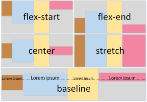
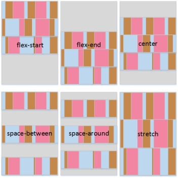

---
description: See how Flexible Box Layout can be used to make the relative position and size of elements adjust as screen and browser window sizes change.
title: Dev guide - Flexbox - Microsoft Edge Development
author: libbymc
ms.author: libbymc
ms.date: 02/08/2017
ms.topic: article
ms.prod: microsoft-edge
keywords: edge, web development, html, css, javascript, developer
---

# Flexible box ("Flexbox") layout

Flexible box layout (flexbox) adds to the four basic layout modes defined in [Cascading Style Sheets, Level 2 Revision 1 (CSS2.1)](http://go.microsoft.com/fwlink/p/?LinkId=142049): block layout, inline layout, table layout, and positioned layout. With Flexbox layout, you can lay out complex webpages more easily and make the relative position and size of elements adjust as screen and browser window sizes change. Flexbox can lessen the reliance on floats and table-based layouts, which are more complicated to position and size correctly.

Flexbox layout makes it easier to:

* Build a layout that is fluid while your page's elements maintain their position and size relative to each other
* Reallocate excess space along the horizontal or vertical layout axes of a series of elements
* Move excess space perpendicular to the layout axis of an element
* Control the visual direction of elements laid out on the page
* Reorder elements on the screen in a different order from how they are specified by DOM

This example shows how Flexbox can be used to create a classic three-column page layout for wider screens that compresses into a single column layout for narrower displays.

See the Flexbox example on [CodePen](https://codepen.io/MicrosoftEdgeDocumentation/pen/BKKKxd). Resize your browser to see how the flexbox layout changes based on your browser window size. 

## Flexbox container and flex items


To enable a flexbox layout, first create a *flex container*. A flex container forms a containing block for its contents (flex items). To create a flex container, apply [`display`](https://msdn.microsoft.com/library/ms530751(v=vs.85).aspx) to an element and set it to `flex` or `inline-flex`:

``` css
display: flex | inline-flex
```

Setting [`display`](https://msdn.microsoft.com/library/ms530751(v=vs.85).aspx) to `flex` causes an element to behave like a block-level flex container box that takes up the full width available inside of its parent container. Setting `display` to `inline-flex` causes an element to behave like an inline-level flex container box, which takes up only as much room as it needs and won't force new lines.

With respect to other elements outside the flex container, inline-level flex containers act similar to images. Block-level flex containers act similar to a normal `div` element.

You can manipulate the flex container and flex items inside the flex container using the flexbox properties listed below.

## Setting flexbox orientation, wrapping, and order

When creating a flex container, you can specify the orientation of all child elements inside of the container. The [`flex-direction`](https://msdn.microsoft.com/library/jj127299(v=vs.85).aspx) property sets the direction of the flex container's main axis, or the primary axis along which flex items are laid out. The `flex-direction` property allows you to specify if the children are displayed from right-to-left, left-to-right, top-to-bottom, or bottom-to-top.

You can also specify how you want the flex items to wrap when the flex container is resized. The [`flex-wrap`](https://msdn.microsoft.com/library/jj127305(v=vs.85).aspx) property determines whether child elements wrap onto single or multiple rows or columns.

Sometimes it's easier to set both the [`flex-direction`](https://msdn.microsoft.com/library/jj127299(v=vs.85).aspx) and [`flex-wrap`](https://msdn.microsoft.com/library/jj127305(v=vs.85).aspx) together by using the [`flex-flow`](https://msdn.microsoft.com/library/jj127300(v=vs.85).aspx) shorthand property. These two sub-properties together define the flex container's main and cross axes.

``` css
flex-flow: <flex-direction> || <flex-wrap>
```

When necessary, the [`order`](https://msdn.microsoft.com/library/jj127303(v=vs.85).aspx) property can visually reorder flex items. By default, flex items in a flex container are displayed in the same order as in the source document unless changed using this property.



To further adjust the alignment, you can also adjust the cross axis alignment of the flex container using the [`align-items`](https://msdn.microsoft.com/library/jj127298(v=vs.85).aspx) property. The cross axis is the axis that is perpendicular to the main axis. The following picture shows the values for `align-items` and their effects on a flex container with three flex items.

``` css
align-items:  flex-start | flex-end | center | baseline | stretch
```

It's also possible to override the value assigned to all the flex items in [`align-items`](https://msdn.microsoft.com/library/jj127298(v=vs.85).aspx), by specifying the [`align-self`](https://msdn.microsoft.com/library/jj127301(v=vs.85).aspx) property on a flex item. `Align-self` sets the alignment value (perpendicular to the layout axis defined by the [`flex-direction`](https://msdn.microsoft.com/library/jj127299(v=vs.85).aspx) property) of the flex items. The initial value is `auto`, which means by default the `align-self` property is equal to the `align-items` property of the parent. The align-items property uses the same values, with the addition of `auto`, as `align-items`. The picture above shows these values and their effects.

``` css
align-self: auto | flex-start | flex-end | center | baseline | stretch
```



You can further adjust alignment using the [`align-content`](https://msdn.microsoft.com/library/jj127304(v=vs.85).aspx) property, which acts similarly to the [`justify-content`](https://msdn.microsoft.com/library/jj127304(v=vs.85).aspx) property. However, the `align-content` property only has an effect when the flexbox has multiple lines. The `align-content` property aligns the flex container's lines within the flex container when there's extra space in the cross axis. This image shows the values for `align-content` and their effects on a flex container with three flex items.

``` css
align-content: stretch | flex-start | flex-end | center | space-between | space-around
```



## Setting the flexibility

If necessary, you can alter the flex items' widths and heights to fill the space in the flex container. To do this, you can use the [`flex`](https://msdn.microsoft.com/library/jj127297(v=vs.85).aspx) shorthand property. The flex container distributes free space to its items proportional to their flex grow factor, or shrinks them to prevent overflow proportional to their flex shrink factor.

The shorthand, [`flex`](https://msdn.microsoft.com/library/jj127297(v=vs.85).aspx), is defined using three sub-properties: [`flex-grow`](https://msdn.microsoft.com/library/dn254947(v=vs.85).aspx), [`flex-shrink`](https://msdn.microsoft.com/library/dn254948(v=vs.85).aspx), and [`flex-basis`](https://msdn.microsoft.com/library/dn254946(v=vs.85).aspx).

``` css
flex: none | [<flex-grow> <flex-shrink>? || <flex-basis>]
```

``` css
#item {
  flex: 2 1 70%;
}
``` 

In the example above, the first sub-value in the [`flex`](https://msdn.microsoft.com/library/jj127297(v=vs.85).aspx) shorthand corresponds to the [`flex-grow`](https://msdn.microsoft.com/library/dn254947(v=vs.85).aspx) property. This property controls the flex growth factor, or how the flex item grows relative to other items in the flex container. The second sub-value corresponds to the [`flex-shrink`](https://msdn.microsoft.com/library/dn254948(v=vs.85).aspx) property which controls how the flex item shrinks relative to other items in the flex container. The third sub-value corresponds to the [`flex-basis`](https://msdn.microsoft.com/library/dn254946(v=vs.85).aspx) property. This property specifies the initial main size of the flex item before free space is distributed. The initial main size is a flex item's width or height along the main (primary) axis. 


## Flexbox changes 
Microsoft Edge matches the latest [W3C CSS Flexible Box Layout Module](http://go.microsoft.com/fwlink/p/?LinkID=259144) specification.

## API Reference
[Flexible Box ("Flexbox") Layout](https://msdn.microsoft.com/library/hh772069(v=vs.85).aspx)

## Demos
[CSS Flexbox sample on CodePen](https://codepen.io/MicrosoftEdgeDocumentation/pen/BKKKxd)


## Specification
[W3C CSS Flexible Box Layout Module](http://go.microsoft.com/fwlink/p/?LinkID=259144)
