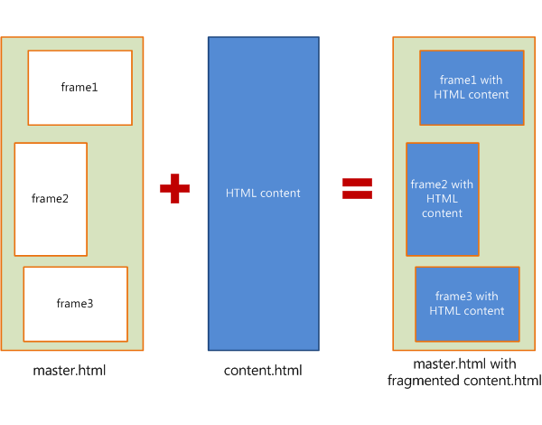
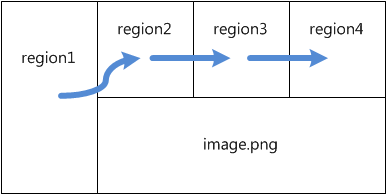
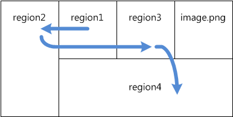

---
description: See how CSS Regions can be used to achieve flexible, magazine-like, content flows through specified regions of the page.
title: Dev guide - Regions
author: libbymc
ms.author: libbymc
ms.date: 02/08/2017
ms.topic: article
ms.prod: microsoft-edge
keywords: edge, web development, html, css, javascript, developer
---

# Regions

CSS Regions is a layout feature used to achieve more flexible, Magazine-like, content flow through specified regions of the page (for example, flowing text along the contour of a mountain). A single HTML content stream of text and images can be segmented into multiple empty containers defined in a standard HTML template. HTML templates are documents that are mostly empty of original content, but are instead composed primarily of empty containers that are sized and positioned to give incoming content a specific layout.

Within a single page, CSS Regions allows web developers to create complex content layouts equivalent to what might be seen in a magazine or newspaper, where multiple regions of the same flow of content (text, related pictures, video, and so on) are shaped around unrelated content elements, such as alternate stories or advertisements.


## Implementing CSS Regions

To implement CSS Regions, you first need an HTML file to serve as your content stream. It is a standalone HTML document that contains its own Document Object Model (DOM) and its own CSS styling. In the following diagram, the content stream is represented by the file "content.html".

You then need an HTML document to serve as the host for the content stream. This host document, or master page, is responsible for sizing and positioning the CSS regions, as well as defining the flow identifier into which the content stream will flow. In the following diagram, the master page is represented by the file "master.html".


When the master page is fully rendered, it will contain connected regions that have the contents of the stream within them. It's important to remember that this fragmentation is purely presentational, and does not affect the DOM structure of the content stream document.

### Creating a data source

CSS Regions require two new CSS properties to enable content to flow from a data source to one region, then another, and so on. Both a data source and an identifier are needed for outlining the content flow. First, place a data source on an [`iframe`](https://msdn.microsoft.com/library/ms535258.aspx) element to load in a separate HTML document. In your master page, create a `iframe` that has a unique ID, such as the following:

```HTML
<iframe id="flow1-data-source" src="content-source.html">
```

Then, create a CSS selector that specifies the data source using the [`-ms-flow-into`](https://msdn.microsoft.com/library/hh771899.aspx) property:

```CSS
#flow1-data-source {
  -ms-flow-into: flow1;
}
```

Be aware that, by placing the `-ms-flow-into` property on the `iframe` element, the element acts as if the [`display`](https://msdn.microsoft.com/library/ms530751.aspx) property was set to "none". This `iframe` element is not intended to be rendered, and will not participate in content fragmentation or layout. This element is solely intended to identify the data source from which to create a flow.

### Creating a CSS Region container

Any non-replaced element can be used as a CSS Region container; however, `div` elements are the most common element used for this purpose.

To create a CSS Region container, on the master page, first assign the elements you intend to use as containers a unique class name, for instance:

```HTML
<div class="flow1-container"></div>
<div class="flow1-container"></div>
<div class="flow1-container"></div>
```

Then, create a CSS selector that specifies the data source from which to accept the content flow using the [`-ms-flow-from`](https://msdn.microsoft.com/library/hh771897.aspx) property:

```CSS
.flow1-container {
  -ms-flow-from: flow1;
}
```

Content in elements that are designated CSS Region containers will be rendered in the DOM source order on the master page. When regions are defined statically, content will be fragmented across the defined container elements in the DOM.


## Extending CSS Regions

You can use source order-independent layout features to create more complex layout scenarios. For instance, the new Grid Alignment feature can be used to create a complex flowable layout. For instance, consider the following markup:

```HTML
<!DOCTYPE html>
<html lang="en-us">
<head>
<style type="text/css">
  #data-source {
    -ms-flow-into: flow1;
  }
  .flow-container {
    -ms-flow-from: flow1;
  }
  #grid {
    display: -ms-grid;
    -ms-grid-columns: 1fr 1fr 1fr 1fr;
    -ms-grid-rows: 384px 384px;
  }
  .A {
    -ms-grid-row: 1;
    -ms-grid-column: 1;
    -ms-grid-row-span: 2;
  }
  .B {
    -ms-grid-row: 1;
    -ms-grid-column: 2;
  }
  .C {
    -ms-grid-row: 1;
    -ms-grid-column: 3;
  }
  .D {
    -ms-grid-row: 1;
    -ms-grid-column: 4;
  }
  .E {
    -ms-grid-row: 2;
    -ms-grid-column: 2;
    -ms-grid-column-span: 3;
  }
</style>
</head>

<body>
<iframe id="data-source" src="content-source.html"></iframe>  
  <div id="grid">
    <div id="region1" class="A flow-container"></div>
    <div id="region2" class="B flow-container"></div>
    <div id="region3" class="C flow-container"></div>
    <div id="region4" class="D flow-container"></div>
    
  </div>
</body>
</html>
```

This makes the content flow as indicated in the following diagram. The arrows indicate the direction of content flow.



Let's swap the order of the first two frames and the last two frames:

```HTML
<iframe id="data-source" src="content-source.html"></iframe>
<div id="region1" class="B flow-container"></div>
<div id="region2" class="A flow-container"></div> 
<div id="region3" class="C flow-container"></div>
<div id="region4" class="E flow-container"></div>

```

This changes the flow as shown in this revised diagram:



This enables you to visually specify the layout of your page without drastically modifying the markup of the template, and without disrupting the DOM of the source content.


## Other CSS Regions scenarios

In addition to the two examples given previously, CSS Regions enables several other useful scenarios:

-   Dynamically create content regions by adding a new `div` to the master page when the current `div` is full.
-   Enable the user to modify the content document, and have the updated content reflow as expected. For instance, a user could choose to increase the size of the text, causing each `div` to be regenerated to guarantee that all the content is visible.
-   Access a fragment range associated with a specific content region.



## API Reference

[Regions](https://msdn.microsoft.com/library/hh772715.aspx)

[-ms-flow-from](https://msdn.microsoft.com/library/hh771897)

[-ms-flow-into](https://msdn.microsoft.com/library/hh771899)

[MSRangeCollection](https://msdn.microsoft.com/library/hh772481)

## Demos

[Hands On: CSS3 Regions](https://developer.microsoft.com/en-us/microsoft-edge/testdrive/demos/3dtransforms/)

## Specification

[CSS Regions Module Level 3](http://go.microsoft.com/fwlink/p/?LinkID=228450), also see the [Working Draft](https://drafts.csswg.org/css-regions/) for upcoming changes. 
