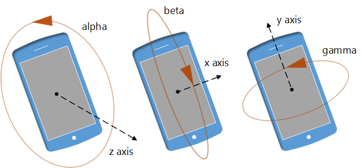

# Device orientation and motion events


Microsoft Edge supports DOM events that provide info about the physical orientation and motion of a device, as defined in the World Wide Web Consortium (W3C) [DeviceOrientation Event spec](http://go.microsoft.com/fwlink/p/?LinkID=316395). This spec defines two different types of sensor data: orientation and motion. By using device orientation and motion events, you can take advantage of modern device sensors to explore new input mechanisms for games, new gestures for apps (such as “shake to clear the screen” or “tilt to zoom”), or even augmented reality experiences. 

## Device orientation events

When a user tilts or rotates their device by 0.01 degrees or more, Microsoft Edge fires the [`DeviceOrientationEvent`](https://msdn.microsoft.com/library/Dn322035) object at the [`window`](https://msdn.microsoft.com/library/ms535873). The data provided by the `DeviceOrientationEvent` object specifies the orientation of the host device in relation to a coordinate frame fixed on the Earth. Specifically, this Earth coordinate frame has the following three axes:

Axis | Description
:-------- | :---------
X (East) | In the ground plane, perpendicular to the north axis, and positive towards the East.
Y (North) | In the ground plane and positive towards true north (towards the North Pole).
Z (Up) | Perpendicular to the ground plane and positive upwards.

These X, Y, and Z axes correspond to the [`beta`](https://msdn.microsoft.com/library/dn322038), [`gamma`](https://msdn.microsoft.com/library/dn322039), and [`alpha`](https://msdn.microsoft.com/library/dn322037) properties of the `DeviceOrientationEvent`, respectively.



The following code snippet shows how to use the [`deviceorientation`](https://msdn.microsoft.com/library/Dn322042) event to guide the user to point their device northward.

```javascript
<div id="directions"></div>
<script>
    window.addEventListener("deviceorientation", findNorth);
    function findNorth(evt) {
        var directions = document.getElementById("directions");
        if (evt.alpha < 5 || evt.alpha > 355) {
            directions.innerHTML = "North!";
        } else if (evt.alpha < 180) {
            directions.innerHTML = "Turn Left";
        } else {
            directions.innerHTML = "Turn Right";
        }
    }
</script>
```

## Device motion events


When a device is being moved or rotated (or more accurately, *accelerated*), the [`DeviceMotionEvent`](https://msdn.microsoft.com/library/Dn342897) object is fired at the [`window`](https://msdn.microsoft.com/library/ms535873) and provides acceleration data in the form of two [`DeviceAcceleration`](https://msdn.microsoft.com/library/Dn342893) objects. The acceleration data provided is for both [with](https://msdn.microsoft.com/library/dn342899) and [without](https://msdn.microsoft.com/library/dn342898) the effects of gravitational acceleration on the device(expressed in m/s²) on the [`x`](https://msdn.microsoft.com/library/dn342894), [`y`](https://msdn.microsoft.com/library/dn342895), and [`z`](https://msdn.microsoft.com/library/dn342896) axes.

Rotational rate of change data is represented by the [`DeviceRotationRate`](https://msdn.microsoft.com/library/Dn342903) object, which contains data on the rotation angles (expressed in deg/s) of [`alpha`](https://msdn.microsoft.com/library/dn322037), [`beta`](https://msdn.microsoft.com/library/dn322038), and [`gamma`](https://msdn.microsoft.com/library/dn322039). Rotations use the [right-hand rule](http://go.microsoft.com/fwlink/p/?LinkID=321282), such that positive rotation around an axis is clockwise when viewed looking towards the positive direction of the axis.

The following code snippet demonstrates how to use the [`ondevicemotion`](https://msdn.microsoft.com/library/Dn342932) event to detect and report any movement of the device above a specified threshold.

```javascript
<div id="status"></div>
<script>
    window.addEventListener("devicemotion", detectShake);
    function detectShake(evt) {
        var status = document.getElementById("status");
        var accl = evt.acceleration;
        if (accl.x > 1.5 || accl.y > 1.5 || accl.z > 1.5) {
            status.innerHTML = "EARTHQUAKE!!!";
        } else {
            status.innerHTML = "All systems go!";
        }
    }
</script>
```

## Calibrating the compass


The [`compassneedscalibration`](https://msdn.microsoft.com/library/Dn629487) event fires when the host device compass requires calibration by the user in order to provide more accurate data from the [`DeviceOrientationEvent`](https://msdn.microsoft.com/library/Dn322035).

The Microsoft Edge implementation of this event fires whenever the host device magnetometer changes to a state of unreliable or approximate accuracy, as defined by the [`MagnetometerAccuracy`](https://msdn.microsoft.com/library/windows/apps/Dn297552) enumeration of the [`Windows.Devices.Sensors`](https://msdn.microsoft.com/library/windows/apps/BR206408) namespace.

## DEMO: Detect an OrientationChange Event on Mobile Devices

For mobile devices with a built-in accelerometer, try this CodePen demo and see the text change from "North!" when held straight up, or "Turn Left" if < 180, otherwise text will read "Turn Right". 

<div class="codepen-wrap"><p data-height="300" data-theme-id="23761" data-slug-hash="RaLjNV" data-default-tab="result" data-user="MSEdgeDev" data-embed-version="2" data-editable="true" class="codepen">See this example by <a href="https://codepen.io/MSEdgeDev">Microsoft Edge Docs</a> on <a href="https://codepen.io/MSEdgeDev/pen/RaLjNV">CodePen</a>.</p></div><script async src="//assets.codepen.io/assets/embed/ei.js"></script>


## API reference

[DeviceOrientationEvent](https://msdn.microsoft.com/library/Dn322035)

[DeviceMotionEvent](https://msdn.microsoft.com/library/Dn342897)

## Specification

[DeviceOrientation Event Specification](http://go.microsoft.com/fwlink/p/?LinkID=316395)


