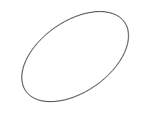

# Canvas

The [Canvas API](https://msdn.microsoft.com/library/hh771733) provides an object that is used for drawing, rendering, and manipulating images and graphics on a document. The [`canvas` object](https://msdn.microsoft.com/library/ff975062) is the JavaScript implementation of the [`<canvas>`](https://msdn.microsoft.com/library/ff975062) element. The `canvas` object provides the surface on which to apply graphics and images. It is not rendered by itself. To draw on the canvas, “contexts” are used, as specified in the [W3C HTML Canvas 2D Context spec](https://www.w3.org/TR/2dcontext/). The actual drawing is done using the [`CanvasRenderingContext2D` object](https://msdn.microsoft.com/library/ff975057), which provides the properties and methods that are used to create and manipulate graphics on a canvas object.

New in Microsoft Edge (EdgeHTML 13) is support for [`HTML Canvas 2D Context, Level 2`](https://www.w3.org/TR/2dcontext/) specifications, including:

-  [*Compositing and Blending*](http://dev.w3.org/fxtf/compositing-1/#canvascompositingandblending) using the `globalCompositeOperation` attribute to set the current compositing and blending operator. See the [`globalCompositeOperation`](https://msdn.microsoft.com/library/ff974909) attribute for a full list of canvas compositing modes, such as `source-over`, `destination-over`, `source-atop`, and `lighter`, as well as canvas blend modes, including `multiply`, `color-dodge`, `saturation`, `luminosity`. 
-  The Canvas [`ellipse`](https://msdn.microsoft.com/library/mt574719) method is also now supported in Microsoft Edge (build 10547+) to draw arcs on a 2D canvas drawing surface. With `ellipse`, you can add points to a path that represents an ellipse -- equivalent to the arc method when the two radii are equal. 

### Sample code for drawing an ellipse

```HTML
<canvas id="canvas"></canvas>
```

```Javascript
var canvas = document.getElementById("canvas");
var foo = canvas.getContext("2d");

foo.beginPath();
foo.ellipse(100, 70, 50, 85, 55 * Math.PI/180, 0, 2 * Math.PI);
foo.stroke();
```


Canvas enables drawing scenarios that include rectangles, paths, lines, fills, arcs, and Bézier and quadratic curves. In addition, the Canvas API supports animations, photo compositions, and real-time video rendering. The [`<canvas>` element](https://msdn.microsoft.com/library/ff975062) is also used by [WebGL](./WebGL.md) to do hardware-accelerated 3D graphics on web pages. The `<canvas>` element has only two attributes, [`width`](https://msdn.microsoft.com/library/ff974792) and [`height`](https://msdn.microsoft.com/library/ff974791) attributes. Both are optional and set using DOM properties with default values for width and height set to 300 and 150 pixels, respectively. The default color is transparent black, but `<canvas>` can be styled just like any normal image (margin, border, background, etc). Styling does not affect the actual drawing on the canvas.

The canvas tag is an “immediate mode” (drawing commands are sent directly to the graphics hardware), two-dimensional drawing surface that you can use to deliver real-time graphs, animations, or interactive games without having to download a separate plug-in. Because of APIs defined by the [`CanvasRenderingContext2D`](https://msdn.microsoft.com/library/ff975057) object, canvas enables the following drawing scenarios that include: rectangles, lines, fills, arcs, shadows, Bézier curves, quadratic curves, images, and video. 

You can use JavaScript to animate canvas drawings or make interactive experiences that can react to keyboard input, mouse clicks, or any browser event.

The following [Canvas 2D Context, Level 2](http://go.microsoft.com/fwlink/p/?LinkID=690352) APIs are supported by Microsoft Edge:

-   the [`msImageSmoothingEnabled`](https://msdn.microsoft.com/library/dn265062) property for choosing between either traditional bilinear scaling or nearest-neighbor scaling when enlarging small images.
-   support for the `even-odd` fill rule value in the canvas [`fill`](https://msdn.microsoft.com/library/ff975415), [`clip`](https://msdn.microsoft.com/library/ff975408), and [`isPointInPath`](https://msdn.microsoft.com/library/ff975419) methods. In addition to the W3C standard fill rule attributes, IE11 offers [`msFillRule`](https://msdn.microsoft.com/library/dn265061), a global fill rule property. This sets the fill rule across all methods, rather than individually setting the fill rule for each.
-   the [`setLineDash`](https://msdn.microsoft.com/library/dn265063), [`getLineDash`](https://msdn.microsoft.com/library/dn265059), and [`lineDashOffset`](https://msdn.microsoft.com/library/dn265060) methods for creating custom stroke dash patterns.


## API Reference

[Canvas](https://msdn.microsoft.com/library/hh771733)

## Demos

[Mandelbrot Explorer](https://developer.microsoft.com/en-us/microsoft-edge/testdrive/demos/mandelbrot/)

[Photo Capture](https://developer.microsoft.com/en-us/microsoft-edge/testdrive/demos/photocapture/)

[Particle Acceleration](https://developer.microsoft.com/en-us/microsoft-edge/testdrive/demos/particleacceleration/)

[Touch Effects](https://developer.microsoft.com/en-us/microsoft-edge/testdrive/demos/toucheffects/)


## Specification

[HTML Canvas 2D Context](https://www.w3.org/TR/2dcontext/)
