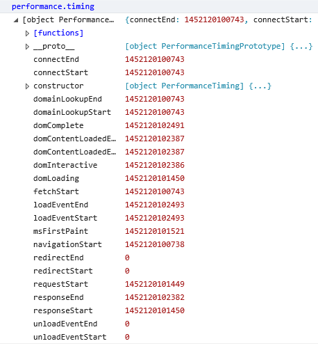

---
description: The Navigation Timing API makes it easy to measure the real-world speed and performance of websites, and locate problem areas that need tuning.
title: Dev guide - Navigation Timing API
author: erikadoyle
ms.author: edoyle
ms.date: 02/08/2017
ms.topic: article
ms.prod: microsoft-edge
keywords: edge, web development, html, css, javascript, developer
---

# Navigation Timing API

The [Navigation Timing API](https://msdn.microsoft.com/library/hh772738.aspx) makes it easy to measure the real-world speed and performance of websites and locate problem areas that need tuning. For example, navigation timing can help you locate latency problems by helping you precisely monitor customer webpage navigation and track the timing of user activities. You can then more easily identify performance bottlenecks and find effective solutions to reduce latency and improve your website's speed and efficiency. The old system of measuring performance couldn't provide the complete end-to-end latency picture that navigation timing enables.

## Measuring navigation timing

You can measure navigation timing in many different ways. Let's look at a few, beginning by opening up the [F12 Console Tool](../../f12-devtools-guide/console.md) and exposing the [`PerformanceTiming`](https://msdn.microsoft.com/library/ff975075.aspx) object containing latency-related performance information. 

```js
//open the F12 tool and enter the following in the console to expose the PerformanceTiming object
performance.timing 
```


*The example above displays the `PerformanceTiming` object for the [Navigation Timing API W3C Spec Page](http://go.microsoft.com/fwlink/p/?LinkId=278978).*

### Measuring display start

The following script calculates the end-to-end client side latency of the most recent page navigation.

```html
<html>
  <head>
    <script type="text/javascript">
    // Add load event listener.
    window.addEventListener("load", loadTime, false);

    function loadTime() {
      // Get current time.
      var now = new Date().getTime();
      // Calculate page load time.
      var page_load_time = now - performance.timing.navigationStart;
      // Write the load time to the F12 console.
      if (window.console) console.log(page_load_time);
    }
     </script>
  </head>
  <body>
    <!-- Main page body is here. -->
  </body>
</html>
```

The JavaScript section in the head sets up an event handler for the load event. When the browser fires the load event, the `loadTime` function is called. The `loadTime` function first gets the current time with the JavaScript [`getTime`](https://msdn.microsoft.com/library/7hcawkw2.aspx) method. Next, the [`performance.timing.navigationStart`](https://msdn.microsoft.com/library/ff974724.aspx) method returns the time immediately after the user agent finishes [prompting to unload](http://go.microsoft.com/fwlink/p/?LinkId=228089) the previous document. The difference between these two timestamps is the user perceived end-to-end page load latency. This difference is displayed in the console, if F12 Tools is running.

### Measuring the various navigation subsystems times

A typical page navigation goes through many phases before the page is displayed to the user. Navigation timing allows you to measure each of these subsystems separately in order to better find the bottlenecks. The following code measures the time it takes to establish a connection.

```js
var t = performance.timing;
var n = performance.navigation;
if (t.connectEnd > 0 &&; t.connectStart > 0) {
  var connection_time = t.connectEnd - t.connectStart;
  if (n.type == n.TYPE_NAVIGATE) {
   if (window.console) console.log(connection_time);
  }
}
```

This JavaScript code uses the Performance Timing API to measure start and end connection times and the [`navigation`](https://msdn.microsoft.com/library/ff974739.aspx) object to determine if this was a page navigation. The script checks to see if the [`connectStart`](https://msdn.microsoft.com/library/ff974711.aspx) and the [`connectEnd`](https://msdn.microsoft.com/library/ff974710.aspx) properties are both greater than zero, to differentiate between a new or cached resource. Then `connectStart` is subtracted from `connectEnd` to determine the connection time. Finally, a check is made to make sure that the type of navigation was generated by user request. The difference is displayed in the console, if F12 Tools is running. This difference is the amount of time spent establishing a connection with the server to load your resource.

### Using JSON

Not only can you use navigation timing to test your pages, you can gather data from your user's experiences and analyze the data for trends. You can use JavaScript Object Notation (JSON) to stringify your results, as in the example below, and send to your server for analysis:

```js
JSON.stringify(window.performance.timing);
```

## Navigation timing APIs


Navigation timing provides a set of objects and properties that you can use to measure many aspects of page navigation. It exposes the following objects:

| Object | Description
|:------------ | :-------------
| [PerformanceNavigation](https://msdn.microsoft.com/library/hh772730.aspx) | Provides information about the navigation state.
| [PerformanceTiming](https://msdn.microsoft.com/library/ff975075.aspx) | Provides information about navigation timing. 

Navigation timing exposes the following properties:

| Property | Description
|:------------ | :-------------
| [connectEnd](https://msdn.microsoft.com/library/ff974710.aspx) | Time when server connection is finished.
| [connectStart](https://msdn.microsoft.com/library/ff974711.aspx) | Time just before server connection begins.
| [domComplete](https://msdn.microsoft.com/library/ff974714.aspx) | Time just before document readiness completes.
| [domContentLoadedEventEnd](https://msdn.microsoft.com/library/hh772735(v=vs.85).aspx) | Time after `DOMContentLoaded` event completes.
| [domContentLoadedEventStart](https://msdn.microsoft.com/library/ff974715(v=vs.85).aspx) | Time just before `DOMContentLoaded` starts.
| [domInteractive](https://msdn.microsoft.com/library/ff974716(v=vs.85).aspx) | Time just before readiness set to `interactive`.
| [domLoading](https://msdn.microsoft.com/library/ff974717(v=vs.85).aspx) | Time just before readiness set to `loading`.
| [domainLookupEnd](https://msdn.microsoft.com/library/ff974712(v=vs.85).aspx) | Time after domain name lookup.
| [domainLookupStart](https://msdn.microsoft.com/library/ff974713(v=vs.85).aspx) | Time just before domain name lookup.
| [fetchStart](https://msdn.microsoft.com/library/ff974718(v=vs.85).aspx) | Time when the resource starts being fetched. 
| [loadEventEnd](https://msdn.microsoft.com/library/ff974721(v=vs.85).aspx) | Time when the load event is complete. 
| [loadEventStart](https://msdn.microsoft.com/library/ff974722(v=vs.85).aspx) | Time just before the load event is fired. 
| [navigationStart](https://msdn.microsoft.com/library/ff974724(v=vs.85).aspx) | Time after the previous document begins unload. 
| [redirectCount](https://msdn.microsoft.com/library/ff974733(v=vs.85).aspx) | Number of redirects since the last non-redirect. 
| [redirectEnd](https://msdn.microsoft.com/library/ff974725(v=vs.85).aspx) | Time after last redirect response ends. 
| [redirectStart](https://msdn.microsoft.com/library/ff974726(v=vs.85).aspx) | Time of fetch that initiated a redirect. 
| [requestStart](https://msdn.microsoft.com/library/ff974728(v=vs.85).aspx) | Time just before a server request. 
| [responseEnd](https://msdn.microsoft.com/library/ff974729(v=vs.85).aspx) | Time after the end of a response or connection. 
| [responseStart](https://msdn.microsoft.com/library/ff974730(v=vs.85).aspx) | Time just before the start of a response. 
| [timing](https://msdn.microsoft.com/library/ff974740(v=vs.85).aspx) | Reference to a performance timing object. 
| [navigation](https://msdn.microsoft.com/library/ff974739(v=vs.85).aspx) | Reference to performance navigation object. 
| [performance](https://msdn.microsoft.com/library/hh772740(v=vs.85).aspx) | Reference to performance object for a window. 
| [type](https://msdn.microsoft.com/library/ff974736(v=vs.85).aspx) | Type of the last non-redirect navigation event. 
| [unloadEventEnd](https://msdn.microsoft.com/library/ff974731(v=vs.85).aspx) | Time after the previous document is unloaded. 
| [unloadEventStart](https://msdn.microsoft.com/library/ff974732(v=vs.85).aspx) | Time just before the unload event is fired. 



## Specification

[Navigation Timing Specification](http://go.microsoft.com/fwlink/p/?LinkId=278978)

