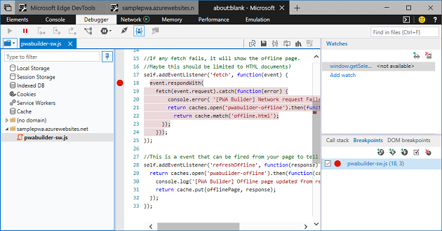
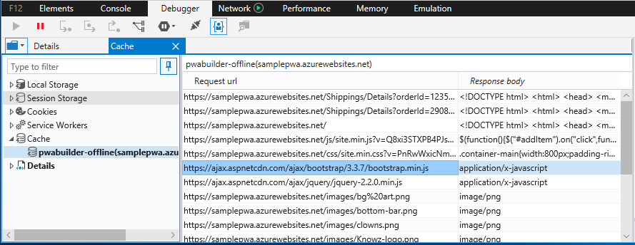

# Progressive Web App debugging

Test out the experimental support for Progressive Web Apps (PWAs) in Microsoft Edge and  DevTools by selecting the **Enable service workers** option from `about:flags` (and restarting Microsoft Edge).

 If a site makes use of **Service Workers** and/or the **Cache** API,  DevTools will populate entries in the **Debugger** panel for each origin, similar to how [web storage](./web-storage.md) and [cookies](./cookies.md) inspection work:

## Service Workers manager

Clicking on a specific service worker entry will open up the **Service Worker Overview**, where you can force **Update** and manage the service worker registration (**Unregister**) for the given scope and send a test **Push** notification. You can also **Stop**/**Start** individual service workers and **Inspect** them from a separate debugger window:

Please note the following about service worker debugging:

 - Debugging a service worker will launch a new instance of the  DevTools separate from the page's tools because service workers can be shared across multiple tabs. 
 - The [**Elements**](../elements.md) and [**Emulation**](../emulation.md) panels are absent from the service worker debugger, given that service workers run in the background and do not directly control the front-end of your app.
 - Currently network traffic for a service worker is only reported from the  DevTools debugging instance for that worker, and not from the central instance for the page itself.

## Cache manager

Clicking on a specific cache entry will open up the **Cache** manager, where you can inspect and optionally delete cache entries (*Request* and *Response* key/value pairs):

## Shortcuts

### Cache manager
Action | Shortcut
:------------ | :-------------
Refresh | `Ctrl` + `F5`
Delete item | `Del`
Copy selected items | `Ctrl` + `C`
Select all | `Ctrl` + `A`