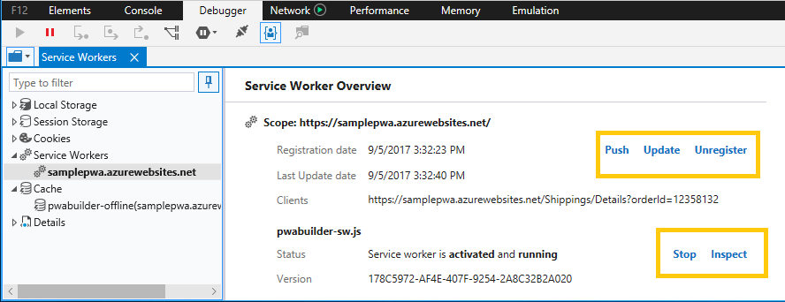
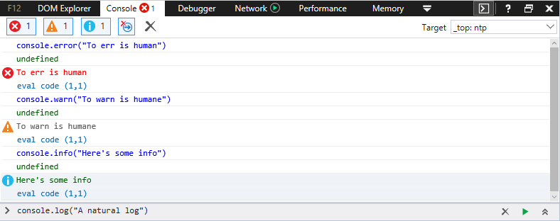

# Microsoft Edge F12 Developer Tools

> [!TIP]
> **[Test on Microsoft Edge free from any browser](https://developer.microsoft.com/en-us/microsoft-edge/tools/remote/)**:
> We partnered with BrowserStack to provide free live and automated testing on Microsoft Edge.

Browser tooling has come a long way since the days of Internet Explorer! The F12 Developer Tools in Microsoft Edge are built with [TypeScript](http://www.typescriptlang.org/), powered by [Visual Studio](https://www.visualstudio.com/), and optimized for modern front-end workflows. Please add and upvote your tooling requests to our [UserVoice forum](https://wpdev.uservoice.com/forums/257854-microsoft-edge-developer/category/84475-f12-developer-tools) to help shape the future of the F12 Developer Tools.

The F12 Developer Tools include:

 - An [Elements](./f12-devtools-guide/dom-explorer.md) panel to edit HTML and CSS, inspect accessibility properties, view event listeners, and set DOM mutation breakpoints
 - A [Console](./f12-devtools-guide/console.md) to view and filter log messages, inspect JavaScript objects and DOM nodes, and run JavaScript in the context of the selected window or frame
 - A [Debugger](./f12-devtools-guide/debugger.md) to step through code, set watches and breakpoints, live edit your code, and inspect your web storage, cookies, and service worker caches
 - A [Network](./f12-devtools-guide/network.md) panel to monitor and inspect requests and responses from the network and browser cache 
 - A [Performance](./f12-devtools-guide/performance.md) panel to profile the time and system resources required by your site
 - A [Memory](./f12-devtools-guide/memory.md) panel to meassure your use of memory resources and compare heap snapshots at different states of code execution
 - An [Emulation](./f12-devtools-guide/emulation.md) panel to test your site with different browser profiles, screen resolutions, and GPS location coordinates

## Coming with the Windows 10 Fall Creators Update

With this release we started a major F12 Tools refactoring effort for improved robustness and future extensibility, and also added a bunch of new features you can start using today! Here are the latest F12 features coming with the [Windows 10 Fall Creators Update](https://www.microsoft.com/en-us/windows/upcoming-features) and available now on [Windows Insider Preview](https://insider.windows.com/en-us/) builds.

### Progressive Web App debuggging

Test out the experimental support for Progressive Web Apps (PWAs) in Microsoft Edge and F12 Tools by selecting the **Enable service workers** option from `about:flags` (and restarting Microsoft Edge). If a site makes use of **Service Workers** and/or the **Cache** API, F12 will populate entries in the **Debugger** panel for each origin, similar to how web storage and cookie inspection work:

Clicking on a specific service worker entry will open up the **Service Worker Overview**, where you can manage the service worker registration for the given scope and force a test push notification. You can also **Stop**/**Start** individual service workers and **Inspect** them from a separate debugger window:

Please note the following about service worker debugging:

 - Although F12 tools are instantiated on a per-tab basis, service workers can be shared across multiple tabs and thus get their own dedicated debugger instances. 
 - The [Elements](./elements.md) and [Emulation](./emulation.md) panels are absent from the service worker debugger, given that service workers run in the background and do not directly control the front-end of your app.
 - Currently network traffic for a service worker is only reported from the F12 debugging instance for that worker, and not from the central F12 instance for the page itself.

Clicking on a specific cache entry will open up the **Cache** manager, where you can inspect and optionally delete cache entries (*Request* and *Response* key/value pairs):

### Ancestor event listeners 

The **Events** pane now adds the option to view event listeners registered on any ancestor of the currently selected element (in the **Elements** panel), in addition to those on the element itself. Additionally, you can now group the event listener display by either *Event* or *Element*. 

### DOM mutation breakpoints

You can now set DOM mutation breakpoints to break into the Debugger whenever a selected element node changes. From the **Elements** panel, rt-click on any element in the DOM tree view and select one or more of the following:

 - Break on Node removed
 - Break on Subtree modified
 - Break on Attribute modified

You can manage your mutation breakpoints from the **DOM breakpoints** pane.

### CSS at-rule support

CSS "at" (@) rules are now represented among other CSS rule declarations on the **Styles** tab, including `@keyframes` percentages (currently limited to read-only), `@supports` feature queries, and `@media` queries.

### CSS fonts pane

CSS `@font-face` rules now have their own dedicated **Fonts** tab that displays where the font is loaded from (*Local* or *Network*) and how many characters are using it. If a font is laoded from the network, F12 will display the rule that imported it along with its alias and font type.

### CSS pseudo-element support

The **Styles** pane now groups pseudo-elements under their own headings and no longer displays their content as crossed out.

### Console improvements

The **Console** panel got a UX overhaul for improved usability and a faster, richer Intellisense experience.

**Before:**

**After:**

We also added these improvments:

 -  Use `SHIFT + ENTER` to add an aditional line to a command before executing it with `ENTER`. (Formerly there was a *Switch to multiline/single-line mode* toggle button.)

 - The following new APIs are supported:
    - [console.table(*object*)](./f12-devtools-guide/console/console_api.md#organizing-log-output) method
    - [getEventListeners(*object*)](./f12-devtools-guide/console/command_line.md#event-listeners) command
    - [keys(*object*)](./f12-devtools-guide/console/command_line.md#object-inspection) command
    - [values(*object*)](./f12-devtools-guide/console/command_line.md#object-inspection) command
    - [$x(*xpath expression*)](./f12-devtools-guide/console/command_line.md#dom-selectors) selector

 - The [%c](./f12-devtools-guide/console/console_api.md#logging-custom-messages) formatting parameter is now supported

### Debugging improvements

In addition to a suite of new features for debugging your [PWA service workers and cache](#progressive-web-app-debugging), the Debugger added these features:

#### Consolidated debugging for shared resources

Even when a resource, such as a file loaded from CDN, is referenced multiple times throughout your code, F12 Tools will now provide a single debugging instance for that file where you can then set common breakpoints which will be hit regardless of where that file is referenced. (Previously each script reference was considered a unique resource would map to a separate set of breakpoints.)

#### Live edit JavaScript with *Edit-on-idle*

You can now edit your JavaScript live during a debugging session. This feature was experimentally available (behind a flag) in the [previous](https://blogs.windows.com/buildingapps/2017/04/05/windows-10-creators-update-creators-update-sdk-released/#MMhK2OdcrR12Vi6u.97) (*Windows 10 Creators Update*) release and now its a permanent feature. Simply select any script file from the **Debugger** tab, edit, then click **Save** (or `CTRL+S`) to test your changes next time that section of code runs. Click the **Compare document to original** button to view the diff of what you changed.

 

Please be aware of the following constraints:

- Script editing only works in external *.js* files (and not embedded `<script>` within *.html*)
- Edits are saved in memory and flushed when the document is reloaded, thus you won’t be able to run edits inside a `DOMContentLoaded` handler, for example
- Currently there’s no way (such as a **Save As** option) to save your edits to disk from F12 Tools

## General Shortcuts

These shortcuts either control the F12 tools window or work across all tools.

Action | Shortcut
:------------ | :-------------
Launch F12 developer tools | Ctrl+Shift+I, Ctrl+Shift+J
Show/hide Console at the bottom of any other tool  | Ctrl+**`**
Switch to DOM Explorer | Ctrl+1
Switch to Console |  Ctrl+2
Switch to Debugger | Ctrl+3
Switch to Network | Ctrl+4
Switch to Performance | Ctrl+5
Switch to Memory | Ctrl+6
Switch to Emulation | Ctrl+7
Switch to Experiments | Ctrl+8
Help Document | F1
Bring application to foreground | F12
Show/Hide F12 | F12
Next tool | Ctrl+F6
Previous tool | Ctrl+Shift+F6
Previous tool (from history) | Ctrl+Shift+[
Next tool (from history) | Ctrl+Shift+]
Next Subframe 	  | F6
Previous Subframe | Shift+F6
Next match in Search box | F3
Previous match in Search box | Shift+F3
Find in search box | Ctrl+F
Give focus to console at the bottom | Alt+Shift+I
Dock/undock tools (toggle docking) | Ctrl+P  
Launch Console | Ctrl+Shift+J
Refresh the page. **Note:** if you're debugging and paused at a breakpoint, this resumes execution first. | Ctrl+Shift+F5 or Ctrl+R
