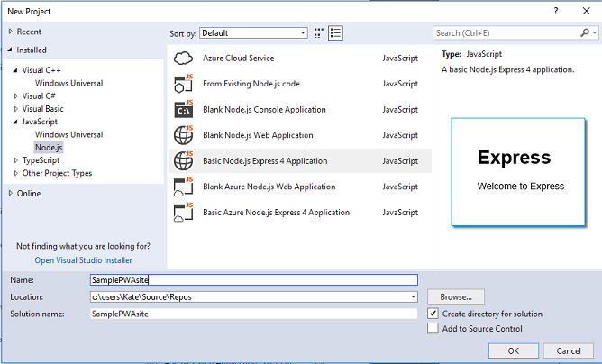
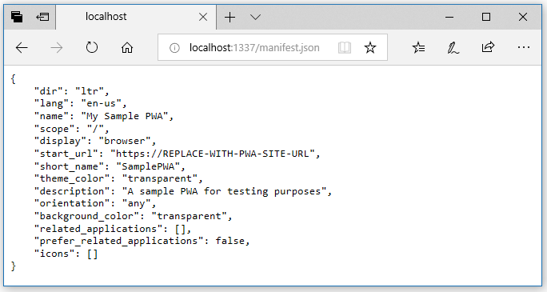
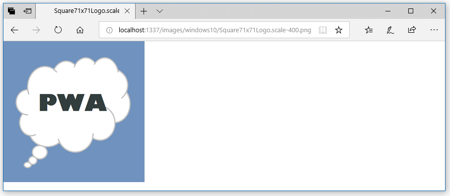
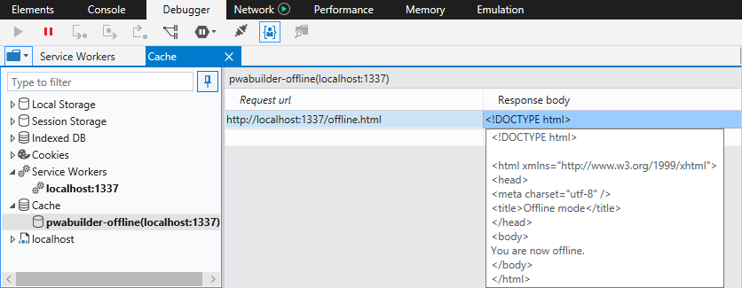

# Get started with Progressive Web Apps

Progressive Web Apps (PWAs) are simply web apps that are [progressively enhanced](https://en.wikipedia.org/wiki/Progressive_enhancement) with native app-like features on supporting platforms and browser engines, such as launch-from-homescreen installation, offline support, and push notifications. On Windows 10 with the Microsoft Edge (EdgeHTML) engine, PWAs enjoy the added advantage of running independently of the browser window as [Universal Windows Platform](https://docs.microsoft.com/en-us/windows/uwp/get-started/whats-a-uwp) apps.

This guide will give you an overview of PWA basics by building a simple *localhost* web app as a PWA using *Microsoft Visual Studio* and some *PWA Builder* utilities.

> [!TIP]
> For a quick way to convert an existing site to a PWA and package it for Windows 10 and other app platforms, check out [PWA Builder](https://www.pwabuilder.com/). 

## Prerequisites

- Download the (free) [Visual Studio Community 2017](https://www.visualstudio.com/downloads/). You can also use the *Professional*, *Enterprise*, or [*Preview*](https://www.visualstudio.com/vs/preview/) editions). From the *Visual Studio Installer*, choose the following Workloads:

    - **Universal Windows Platform development**
    - **Node.js development**

## 1. Set up a basic web app

For the sake of simplicity, we'll use the Visual Studio [Node.js and Express app](https://docs.microsoft.com/en-us/visualstudio/nodejs/tutorial-nodejs) template to create a basic, localhost web app that serves up an *index.html* page. Imagine this as a placeholder for the awesome web app you'll be developing as a PWA.

1. Launch Visual Studio, and start a new project (**File** > **New** > **Project...** *or* Ctrl+Shift+N).

2. Under **JavaScript**, select **Basic Node.js Express 4 Application**. Set the name and location and click **OK**.

    

3. Once your new project loads, **Build** (Ctrl+Shift+B) and **Start Debugging** (F5). Verify that your *index.html* file is loading on *http://localhost:1337*.

    

## 2. Turn your app into a PWA

Now its time to wire up the basic [PWA requirements](../progressive-web-apps.md#requirements) for your web app: a *Web App Manifest*, *HTTPS* and *Service Workers*.

### Web App Manifest

A [*Web App Manifest*](https://developer.mozilla.org/en-US/docs/Web/Manifest) is a JSON metadata file describing your app, including its name, author, entry page URL, and icon(s). Because it follows a [standards-based schema](https://www.w3.org/TR/appmanifest/), you need only supply a single web app manifest for your PWA to be installable on any platform / OS / device that supports PWAs. In the Windows ecosystem, your web app manifest signals to the Bing web indexer that your PWA is a candidate for [automatic inclusion in the Microsoft Store](./microsoft-store.md), where it can reach nearly 700 million active monthly users as a Windows 10 app.

If this were an existing live site, you could quickly generate a web app manifest using [PWA Builder](https://www.pwabuilder.com/). Since its still an unpublished project, we'll copy in a sample manifest.

1. In the Visual Studio *Solution Explorer*, right-click the *public* folder and select **Add** > **New File...**, specifying `manifest.json` as the item name.

2. In the *manifest.json* file, copy in the following boilerplate:

    ```JSON
    {
        "dir": "ltr",
        "lang": "en-us",
        "name": "My Sample PWA",
        "scope": "/",
        "display": "browser",
        "start_url": "https://PLACEHOLDER-FOR-PWA-URL",
        "short_name": "SamplePWA",
        "theme_color": "transparent",
        "description": "A sample PWA for testing purposes",
        "orientation": "any",
        "background_color": "transparent",
        "related_applications": [],
        "prefer_related_applications": false,
        "icons": []
    }
    ```
    If this were a real PWA, you'd obviously want to customize at least the *name*, *start_url*, *short_name*, and *description*, as well as the *icons* (we'll get to those next...). 

    See the [Web App Manifest](https://developer.mozilla.org/en-US/docs/Web/Manifest
) reference on *MDN web docs* to learn more about the different member values and their purpose.

3. Next, let's fill in the empty `icons` array with actual image paths. For that, we'll use PWA Builder's *App Image Generator*.

    1. Save down this [sample 512x512 PWA image](./media/pwa.png) from your web browser.

    2. Go to the PWA Builder [App Image Generator](https://appimagegenerator-prod.azurewebsites.net/), and select the *pwa.png* image you just saved as the **Input Image** and then click the **Download** button.

    3. **Open** and **Extract** the zip file.
    
    4. In the Visual Studio *Solution Explorer*, right-click the *public* folder and **Open Folder in File Explorer**. Create a **New folder** named *images*.
    
    5. Copy all of the platform folders (*android*, *chrome*, ...*windows10*) from your extracted zip to the *images* folder and close the file explorer window. Add these folders to your Visual Studio project (in *Solution Explorer*, right-click *images* folder and select **Add** > **Existing folder...** for each of the folders.)

    6. Open (with Visual Studio or any editor) the *icons.json* file from the extracted zip and copy the `"icons": [...]` array into your project's *manifest.json* file.

4. Now we just need to associate our web app manifest with the app itself. Open the *layout.pug* file (in *views* folder) for editing, and add this line right after the stylesheet link. (Its simply Node's [pug](https://pugjs.org/language/attributes.html) template shorthand for `<link rel='manifest' href='/manifest.json'>`).

    ```
    link(rel='manifest', href='/manifest.json')
    ``` 

With all that in place, your web app is now serving up a manifest and homescreen-ready app icons! Try running your app (F5) and loading up the manifest:



And one of your icons:



If your app were published live (with an actual `start_url`), the Bing search engine could now identify it as a candidate for [automatic packaging and submission to the Microsoft Store](./microsoft-store.md) as an installable Windows 10 app. Just make sure that your manifest includes the [*Quality signals for Progressive Web Apps*](https://blogs.windows.com/msedgedev/2018/02/06/welcoming-progressive-web-apps-edge-windows-10/#4UOdrDJj3124VIkc.97) that Bing will be scanning for:

 - `name`

 - `description`
 
 - At least one icon 512px square or larger (to ensure an image source of sufficient resolution for auto-generating you app's splash screen, store listing, tile image, etc.)

 ...in addition to being [HTTPS](#https), using [service workers](#service-workers), complying with [Microsoft Store Policies](https://docs.microsoft.com/en-us/legal/windows/agreements/store-policies).

### HTTPS

[Service Workers](https://developer.mozilla.org/en-US/docs/Web/API/Service_Worker_API) and other key PWA technologies that work with service workers (such as the [Cache](https://developer.mozilla.org/en-US/docs/Web/API/Cache), [Push](https://developer.mozilla.org/en-US/docs/Web/API/Push_API), and [Background Sync](https://developer.mozilla.org/en-US/docs/Web/API/SyncManager) APIs) only work across secure connections, which means [*HTTPS*](https://en.wikipedia.org/wiki/HTTPS) for live sites or *localhost* for  debugging purposes.

If you were to [publish this web app as a live site](https://docs.microsoft.com/en-us/visualstudio/nodejs/tutorial-nodejs#optional-publish-to-azure-app-service) (for example, by setting up an [*Azure free account*](https://azure.microsoft.com/en-us/free/)), you'll want to ensure your server is configured for HTTPS. If you're using the [Microsoft Azure App Service](https://azure.microsoft.com/en-us/services/app-service/web/) to host your site, it will will be served over HTTPS by default.

For this guide we'll continue using *http://localhost* as a placeholder for a live site served over *https://*.

### Service Workers

*Service Workers* is the key technology behind PWAs. They act as a proxy between your PWA and the network, enabling your website to act as an installed native app: serving up offline scenarios, responding to server push notifications, and running background tasks.

Service workers are event-driven background threads that run from JavaScript files served up alongside the regular scripts that power your web app. You associate a service worker with your app by *registering* it to your site's URL origin (or a specified path within it). Once registered, the service worker file is then *downloaded*, *installed*, and *activated* on the client machine. For more, *MDN web docs* has a comprehensive guide on [Using Service Workers](https://developer.mozilla.org/en-US/docs/Web/API/Service_Worker_API/Using_Service_Workers) and a detailed [Service Worker API](https://developer.mozilla.org/en-US/docs/Web/API/Service_Worker_API) reference.

For this tutorial, we'll use a ready-made "Offline page" service worker script courtesy of [PWA Builder](https://www.pwabuilder.com/serviceworker). Mozilla's [Service Worker Cookbook](https://serviceworke.rs/) also features a number of useful service worker caching "recipes" you can try out and modify according to your needs for performance, network bandwidth, offline, etc.

1. Open https://www.pwabuilder.com/serviceworker and select the (default) **Offline page** service worker and click the **Download service worker** button.

2. Open the download folder and copy these two files:

    - ServiceWorker1\pwabuilder-sw-register.js
    - ServiceWorker1\pwabuilder-sw.js
    
    ...to the *public* folder of your Visual Studio web app project. (From Visual Studio, use Ctrl+O to open file explorer to your project and navigate to the *public* folder). 

    Its worth reviewing the code in both of these files, to get the jist of how to register a service worker that caches a designated page (*offline.html*) and serves it when a network fetch fails. Next, we need to create a simple "offline.html" page as a placeholder for our app's offline functionality.

3. In *Solution Explorer*, open the *views/layout.pug* file, and add the following line below your link tags:

    ```HTML
    script(src='/pwabuilder-sw-register.js')
    ```
   So that your site will load and run your service worker registration script.
   
4. In *Solution Explorer*, right-click on the *public* folder and select **Add** > **HTML file**. Name it **offline.html**, and add a `<title>` and some body content, for example:

    ```HTML
    <!DOCTYPE html>

    <html xmlns="http://www.w3.org/1999/xhtml">
    <head>
        <meta charset="utf-8" />
        <title>Offline mode</title>
    </head>
    <body>
        You are now offline.
    </body>
    </html>
    ```
    At this point, your *public* folder should have three new files:

    

5. From *Solution Explorer*, open the *routes\index.js* file, and add the following code just before the final command (`module.exports = router;`):

    ```JavaScript
    router.get('/offline.html', function (req, res) {
        res.sendFile('public/offline.html');
    });
    ```

    This instructs your app to serve the *offline.html* file (when your service worker fetches it for the offline cache).

6. Let's test out your PWA! Build (Ctrl+Shift+B) and Run (F5) your web app to launch Microsoft Edge and open your *localhost* page. Then,

    1. Open the Edge DevTools **Console** (Ctrl+Shift+J) and verify your *Service worker has been registered*.
    2. In the **Debugger** panel, expand the **Service Workers** control and click on your origin. In the *Service Worker Overview*, verify your service worker is activated and running:

        
    3. Still in the Debugger, expand the **Cache** control and verify that the *offline.html* page has been cached.

        

7. Time to try your PWA as an offline app! In Visual Studio, **Stop Debugging** (Shift+F5) your web app, then open Microsoft Edge (or reload) to your website's localhost address. It should now load the *offline.html* page (thanks to your service worker and offline cache)!

    

 Of course, there's a lot more that goes into [making a great PWA](../progressive-web-apps.md#requirements), including responsive design, deep-linking, cross-browser testing and other best practices (not to mention *actual* app functionality!), but hopefully this guide gave you a solid introduction of PWA basics and some ideas on getting started with PWA development.

This guide demonstrated how PWAs run in the Microsoft Edge browser. Check out the [*Tailor your PWA for Windows*](./windows-features.md) guide to install, run, and enhance your PWA as a standalone Windows 10 app.

If you have further questions on PWA development with Windows and/or Visual Studio, please leave a comment!

## Going further

Check out our other PWA guides to learn how to increase customer engagement and provide a more seamless, OS-integrated app experience:

 - **Push notifications.** Set up a push messaging service, service worker handler, and custom toast notifications to re-engage your users. Check out the Push API / Notification API examples in [*Service Workers: Going beyond the page*](https://blogs.windows.com/msedgedev/2017/12/19/service-workers-going-beyond-page/#8mU5rebKOuTt5HwG.97) to get started.

 - [**Windows tailoring.**](./windows-features.md) Using simple feature detection, you can progressively enhance your PWA for Windows 10 customers through native Windows Runtime (WinRT) APIs, such as those for customizing Windows **Start** menu tile notifications and taskbar jumplists, and (upon permission) working with user resources, such as photos, music and calendar.

 - [**PWAs in the Microsoft Store.**](./microsoft-store.md) Learn more about the benefits of app store distribution and how to submit your PWA.

Also be sure to explore the great resources from around the dev community! [MDN web docs](https://developer.mozilla.org/en-US/Apps/Progressive/) and [Google Developers](https://developers.google.com/web/progressive-web-apps/) have excellent guides on Progressive Web Apps. https://pwa.rocks/ showcases real-world examples of PWAs, and https://hnpwa.com/ compares different frameworks and performance patterns for implementing a sample (*Hacker News* reader) PWA.
