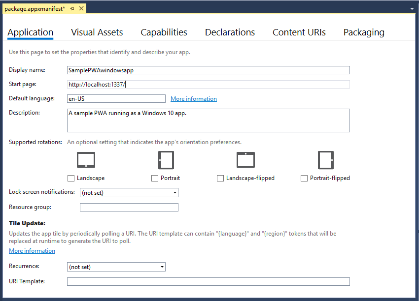
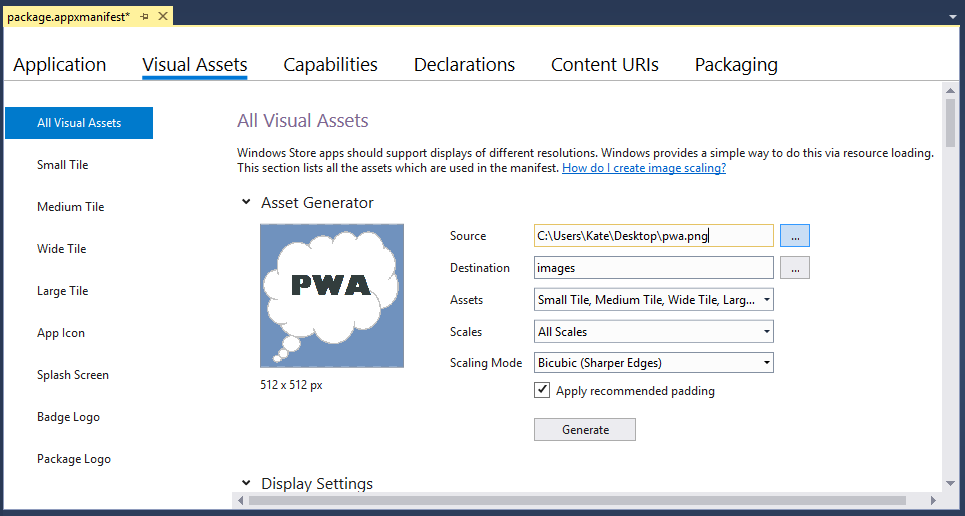
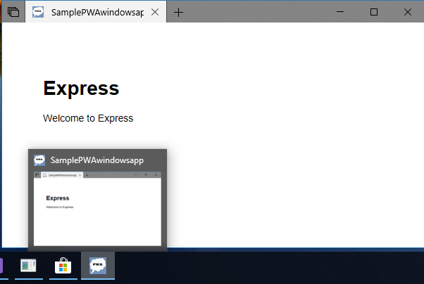
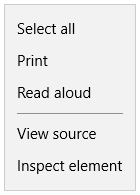

# Tailor your PWA for Windows

PWAs installed on Windows 10 enjoy [all the benefits](../progressive-web-apps.md#pwas-on-windows-10) of running as [Universal Windows Platform](https://docs.microsoft.com/en-us/windows/uwp/get-started/universal-application-platform-guide) (UWP) apps, including protection through Windows app sandboxing security and full access to [Windows Runtime](https://docs.microsoft.com/en-us/uwp/api/) (WinRT) APIs, including those for:

- Controlling device features (such as camera, microphone, GPS)
- Accessing user resources (such as calendar, contacts, documents,  music) 
- Launching / navigating your app through Cortana voice commands
- Integrating with the Windows OS (through the Windows *Action Center*, desktop taskbar, and context menus)

...and these are only a few of the added possibilities for your PWA on Windows!

This guide will show you how to install, run, and enhance your PWA as a Windows 10 app, while still ensuring cross-browser and cross-platform compatibility.

## Prerequisites

- An existing PWA (or hosted web app), either a live or localhost site. This guide will use the sample PWA from [*Get started with Progressive Web Apps*](./get-started.md).

- Download the (free) [Visual Studio Community 2017](https://www.visualstudio.com/downloads/). You can also use the *Professional*, *Enterprise*, or [*Preview*](https://www.visualstudio.com/vs/preview/) editions). From the *Visual Studio Installer*, choose the following Workloads:

    - **Universal Windows Platform development**
 
## Set up and run your *Universal Windows* app

A PWA installed as a Windows 10 app runs independently from the browser, in a standalone (*WWAHost.exe* process) window. Enabling this simply requries a lightweight "app wrapper" that contains your hosted web app, which you can quickly set up using the Visual Studio *Progressive Web App (Universal Windows)* project template. (All your app logic, including native Windows Runtime API calls, still happens in your original web app code.)

Let's set up our Windows app development environment in Visual Studio.

1. In your Windows **Settings**, turn on [**Developer mode**](https://docs.microsoft.com/en-us/windows/uwp/get-started/enable-your-device-for-development). (Type "developer mode" in the Windows searchbar to find it.)

1. Launch *Visual Studio* and **Create new project...**

2. Under the *JavaScript* > *Windows Universal* category, select:

    - **Hosted Web App (Universal Windows)** if you're using a release version of Visual Studio, or
    - **Progressive Web App (Universal Windows)** if you're using a *Visual Studio Preview* build

    (The underlying project template is the same.)

3. Select the default Windows 10 *Target version* (most recent release) and *Minimum version* (build 10586 or higher) and click **OK**.

    

    Your new project will then load with the *package.appxmanifest* designer open. This  is where you'll configure the details of your app, including package identity, package dependencies, required capabilities, visual elements, and extensibility points. This is an easily configurable, temporary version of the app package manifest used during app development.

    When you build your app project, [Visual Studio generates an *AppxManifest.xml*](https://docs.microsoft.com/en-us/uwp/schemas/appxpackage/uapmanifestschema/generate-package-manifest) file from this metadata, which will be used for installing and running your app. Whenever you update your *package.appxmanifest* file, be sure to rebuild the project so they are reflected in your *AppxManifest.xml* at runtime.

4. In the manifest designer **Application** panel, enter the URL of your PWA as the **Start page**. 

    

    You can also modify the **Display name** and **Description** as you like.

5. [Save down this file]() (or another 512x512 image of your choosing) locally. 

    Then, in the manifest designer **Visual Assets** panel, click on the **Source** field **...** button, select it as your source file, and click **Generate**. (Then click **OK** to overrite the default placeholder images).

    

    This will generate the basic visual assets for installing, running, launching, and distributing your app in the store. 
    
    If you see any red ('X') errors indicating missing images, you can click on the **...** buttons to manually select a file from the generated images.

6. In the manifest designer **Content URIs** panel, replace *http://example.com* with the location of your PWA (such that **Rule** = *include* and **WinRT Access** = *All*). 

    This grants your PWA permission to call native Windows Runtime (WinRT) APIs when running as a Windows 10 app, which we'll do a bit later. If your actual PWA doesn't require WinRT access, you can switch the **WinRT Access** value to *None*. Either way, be sure to sub out the default *http://example.com* string with the URI of your PWA, or your app won't properly load at runtime.

    You're ready run and debug your PWA as a Windows 10 app. If you're using a localhost site to step through this guide, make sure its running. Then,

7. **Build** (Ctrl+Shift+F5) and **Run** (F5) your PWA project. Your website should now launch in a standalone app window. Not only is it  a *hosted web app*; it's running as a *Progressive Web App* installed on Windows 10!

    

## Debug your PWA as a Windows app

Because a PWA is simply a progressively enhanced *hosted web app*, you can debug your server-side code the same way you would any web app, using your usual IDE and workflow. The changes you deploy live will be reflected in your installed PWA the next time you launch it (no need to redeploy your *Universal Windows* app package).

For client-side debugging within your Windows 10 app, you'll need the *Microsoft Edge DevTools Preview* app. This standalone app includes all the functionality of the original in-browser [Microsoft Edge DevTools](../devtools-guide.md) (including [PWA tools](../devtools-guide/debugger/progressive-web-apps.md)), plus basic [remote debugging](../devtools-protocol/0.1/clients.md#microsoft-edge-devtools-preview) support and a [*Debug Target* chooser](../devtools-guide.md#microsoft-store-app) for attaching to *any* running instance of the EdgeHTML engine, including add-ins for *Office*, *Cortana*, app webviews, and of course, *PWAs running on Windows*.

Here's how to set up debugging for your PWA.

1. Install the [**Microsoft Edge DevTools Preview**](https://www.microsoft.com/en-us/store/p/microsoft-edge-devtools-preview/9mzbfrmz0mnj) app from the Microsoft Store if you don't already have it.

2. With your PWA site up and running, launch the DevTools app.

3. From Visual Studio, launch your Windows 10 app with the **Start Without Debugging** (Ctrl+F5) command. (The DevTools app won't attach properly if the Visual Studio debugger is active.)

4. In the DevTools app, click the **Refresh** button in the *Local* debug target chooser. Your PWA site should now be listed. (If its also running in a browser window from *step 2*, it will be the last instance of that site in the list.)

5. Click on your PWA site listing to open a new DevTools instance tab and start debugging.

    

6. You can verify that DevTools is attached to your *PWA-running-as-Windows-app*. In the DevTools **Console**, type:
 
    ```
    window.Windows
    ```

    This will return the global *Windows Runtime* object containing  all the [top-level WinRT namespaces](#find-windows-runtime-winrt-apis). This is your PWA's entrypoint to the [*Universal Windows Platform*](https://docs.microsoft.com/en-us/windows/uwp/index), and only
    exposed to web apps that run as Windows 10 apps (running outside the browser, in a *WWAHost.exe* process).

## Find Windows Runtime (WinRT) APIs

As an installed Windows app, your [PWA has full access to native *Windows Runtime* APIs](../windows-runtime.md); its just a matter of identifying what you need to use, obtaining the requisite permissions, and employing feature detection to call that API on supported environments. Let's walk through this process to add a progressive enhancement for Windows desktop users of your PWA.

There are a number of ways to identify the *Universal Windows Platform* APIs you need for your Windows PWA, including searching the comprehensive [UWP docs on Windows Dev Center](#windows-dev-center), downloading and running [UWP code samples](#uwp-code-samples) with Visual Studio, and browsing code snippets for common tasks for [PWAs on Windows](#windows-pwa-snippets).

### Windows Dev Center

Overall, WinRT APIs work in JavaScript the same way they do in C#, so you can follow the general [Universal Windows Platform documentation](https://docs.microsoft.com/en-us/windows/uwp/index) and [API Reference](https://docs.microsoft.com/en-us/uwp/api/) for usage. However, please note the following differences:

 - WinRT features in JavaScript use  [different casing conventions](https://docs.microsoft.com/en-us/scripting/jswinrt/using-the-windows-runtime-in-javascript#casing-conventions-with-windows-runtime-features)
 - [Events are represented as string identifiers](https://docs.microsoft.com/en-us/scripting/jswinrt/handling-windows-runtime-events-in-javascript) passed to class `addEventListener`/`removeEventListener` methods
 - [Asynchronous methods](https://docs.microsoft.com/en-us/scripting/jswinrt/using-windows-runtime-asynchronous-methods) use the JavaScript Promise model
 - APIs in the `Windows.UI.Xaml` namespace are not supported for JavaScript apps, which instead use the [EdgeHTML](https://docs.microsoft.com/en-us/microsoft-edge/dev-guide/whats-new) engine web rendering stack (HTML, CSS)

For more details, see [*Using the Windows Runtime in JavaScript*](../windows-runtime/using-the-windows-runtime-in-javascript.md).

### UWP code samples

Check out the [Universal Windows Platform (UWP) Code Samples](https://developer.microsoft.com/en-us/windows/samples) repo to browse JavaScript examples for common Windows 10 app scenarios. Although the JS versions of these samples use the [WinJS](https://github.com/winjs/winjs) library to structure the sample template, WinJS is not required for calling the WinRT APIs demonstrated by these samples. Note that if you need to listen for the app's [`activated`](https://docs.microsoft.com/en-us/uwp/api/windows.ui.webui.webuiapplication.activated) event, you can do this using the following native WinRT API:

**USE THIS**
```JavaScript
Windows.UI.WebUI.WebUIApplication.addEventListener("activated", function (activatedEventArgs) {
    // Check activatedEventArgs.kind and respond as needed
});
```
...as opposed this type of WinJS call used in the samples:

**NOT THIS**
```JavaScript
    var page = WinJS.UI.Pages.define("/html/scenario1-launched.html", {
        ready: function (element, options) {
            // Check options.activationKind and respond as needed
        }
    });
```

## Call WinRT APIs from your PWA

At this point, let's pretend we want to add a custom context menu for Windows users of our PWA and have identified the APIs we need in the in the [Windows.UI.Popups](https://docs.microsoft.com/en-us/uwp/api/windows.ui.popups) namespace.

In order to call any WinRT APIs from our PWA, we'll first need to [establish the requisite permissions](#set-application-content-uri-rules-acurs) (or, *Application Content URI Rules*) in your Windows app package manifest (*.appxmanifest*) file.

If any of these API calls involve access to user resources like pictures or music, or to device features like the camera or microphone, we'll also need to add [app capability declarations](#app-capability-declarations) to the app package manifest in order for Windows to prompt the user for permission. If you later publish your PWA to the Microsoft Store, these required [App permissions](https://support.microsoft.com/en-us/help/10557/windows-10-app-permissions) are also noted in your store listing.

#### Set Application Content URI Rules (ACURs)

Through ACURs, otherwise known as a *URL allow list*, you are able to give the URLs of your PWA direct access to Windows Runtime APIs. At the Windows OS level, the right policy bounds will be set to allow code hosted on your web server to directly call platform APIs. You define these bounds in the app package manifest file when you specify your PWA's URLs as `ApplicationContentUriRules`.

Your rules should include your app’s start page and any other pages you want included as app pages. If your user navigates to a URL that is *not* included in your rules, Windows will open the target URL in the Microsoft Edge browser rather than your standalone PWA window (*WWAHost.exe* process). You can also exclude specific URLs. 

There are several ways to specify a URL `Match` in your rules:

- An exact hostname
- A hostname for which a URI with any subdomain of that hostname is included or excluded
- An exact URI
- An exact URI containing a query property
- A partial path and a wildcard to indicate a particular file extension for an include rule
- Relative paths for exclude rules

Here are a few examples of ACURs in a *.appxmanifest* file:

```XML
<Application
Id="App"
StartPage="https://contoso.com/home">
<uap:ApplicationContentUriRules>
    <uap:Rule Type="include" Match="https://contoso.com/" WindowsRuntimeAccess="all" />
    <uap:Rule Type="include" Match="https://*.contoso.com/" WindowsRuntimeAccess="all" />
    <uap:Rule Type="exclude" Match="https://contoso.com/excludethispage.aspx" />
</uap:ApplicationContentUriRules>
```

URLs defined within the app's ACURs can be granted permission to the Windows Runtime through the `WindowsRuntimeAccess` attribute, which accepts the following values:

- **all**: Remote JavaScript code has access to all WinRT APIs and any local packaged components. The [Windows](https://docs.microsoft.com/en-us/uwp/api/) (WinRT) namespace will be injected and present in the script engine
- **allowForWeb**: Remote JavaScript code access is limited to local packaged components, including custom C++/C# components.
- **none**: Default. The specified URL has no platform access.

In this tutorial, we've already set the only ACUR we need (*Step 6* of the previous [*Set up and run your app*](#set-up-and-run-your-universal-windows-app) section) for our "single-page app". You can confirm this from the **Content URIs** panel of the Visual Studio *package.appxmanifest* designer.

 

You can also view the raw XML of your manifest by right-clicking your *package.appxmanifest* file in Visual Studio *Solution Explorer* and selecting **View Code** (F7). To toggle back to the *Designer* view, select **View Designer** (Shift+F7).

#### App capability declarations

If your app needs programmatic access to user resources like pictures or music, or to devices like a camera or a microphone, you'll need to include the corresponding [*App capability declarations*](https://docs.microsoft.com/en-us/windows/uwp/packaging/app-capability-declarations) in your app package manifest file. There are three app capability declaration categories: 

- [General-use capabilities](https://docs.microsoft.com/en-us/windows/uwp/packaging/app-capability-declarations#general-use-capabilities) that apply to most common app scenarios. 
- [Device capabilities](https://docs.microsoft.com/en-us/windows/uwp/packaging/app-capability-declarations#device-capabilities) that allow your app to access peripheral and internal devices. 
- [Special-use capabilities](https://docs.microsoft.com/en-us/windows/uwp/packaging/app-capability-declarations#special-and-restricted-capabilities) that support enterprise scenarios and require a Microsoft Store *company account*. For more info about company accounts, see [*Account types, locations, and fees*](https://docs.microsoft.com/en-us/windows/uwp/publish/account-types-locations-and-fees).

Your app's Microsoft Store page will list all the capabilities you declare in your app package manifest, so be sure to only specify the capabilities that your app actually uses.

Some capabilities provide apps access to sensitive resources. These resources are considered sensitive because they can access the user’s personal data or cost the user money. Privacy settings, managed by the Windows 10 [**Settings**](https://binged.it/2lOGSH0) app, let the user dynamically control access to sensitive resources. Thus, it’s important that your app doesn’t assume a sensitive resource is always available. For more info about accessing sensitive resources, see [*Guidelines for privacy-aware apps*](https://msdn.microsoft.com/library/windows/apps/hh768223.aspx).

You request access by declaring capabilities in your app’s package manifest. In Visual Studio, you can do this from the **Capabilities** panel of the *package.appxmanifest* designer.

 

In this tutorial, we only require the default *Internet (Client)* capability, so no further action is needed.

### Use feature detection to invoke WinRT

To ensure a quality baseline experience for our PWA audience across all platforms, we'll progressively enhance our PWA experience on Windows using WinRT feature detection. This way, we can be sure our Windows-specific code is only executed in a context where WinRT APIs are available and applicable.

Feature detection can be as simple as looking for the `Windows` object (the entrypoint to the [WinRT namespace](https://docs.microsoft.com/en-us/uwp/api/)) as below:

```JavaScript
if(window.Windows){
/*Execute code that calls Windows APIs */
}
```

However, given that not all Windows APIs are available on all [Windows 10 device types](https://docs.microsoft.com/uwp/extension-sdks/device-families-overview), its generally useful to use more specific feature detection to further qualify the namespace of the API you'll be calling:

```JavaScript
if(window.Windows && Windows.Media.SpeechRecognition){
/*Execute code that calls Windows APIs */
}
```

With that background, we're ready to add some WinRT code to implement a custom context menu. If you're using the sample PWA from [*Get started with Progressive Web Apps*](./get-started.md):

1. Open Visual Studio to your PWA site project.

2. In *Solution Explorer*, open the *views\layout.pug* file and add the following line, right below the `script` reference for your service worker:

    ```
    script(src='/javascripts/site.js')
    ```

3. In *Solution Explorer*, right-click on the *javascripts* folder and **Add** > **New File...**.

4. Name your file: *site.js*, and copy in the following code:

    ```JavaScript
    if (window.Windows && Windows.UI.Popups) {
        document.addEventListener('contextmenu', function (e) {

            // Build the context menu
            var menu = new Windows.UI.Popups.PopupMenu();
            menu.commands.append(new Windows.UI.Popups.UICommand("Option 1", null, 1));
            menu.commands.append(new Windows.UI.Popups.UICommandSeparator);
            menu.commands.append(new Windows.UI.Popups.UICommand("Option 2", null, 2));

            // Convert from webpage to WinRT coordinates
            function pageToWinRT(pageX, pageY) {
                var zoomFactor = document.documentElement.msContentZoomFactor;
                return {
                    x: (pageX - window.pageXOffset) * zoomFactor,
                    y: (pageY - window.pageYOffset) * zoomFactor
                };
            }

            // When the menu is invoked, execute the requested command
            menu.showAsync(pageToWinRT(e.pageX, e.pageY)).done(function (invokedCommand) {
                if (invokedCommand !== null) {
                    switch (invokedCommand.id) {
                        case 1:
                            console.log('Option 1 selected');
                            // Invoke code for option 1
                            break;
                        case 2:
                            console.log('Option 2 selected');
                            // Invoke code for option 2
                            break;
                        default:
                            break;
                    }
                } else {
                    // The command is null if no command was invoked.
                    console.log("Context menu dismissed");
                }
            });
        }, false);
    }
    ```

5. Compare the context menu behavior when you run your PWA in the browser (*F5* from your PWA site project) versus from inside its Windows app window (*F5* from your *Universal Windows* app project). In the browser, right-clicking gives you the Edge's default context menu, whereas in the *WWAHost.exe* process, your custom menu now appears.

    Microsoft Edge | Windows 10 app
    :--- | :---- 
     | 

Hopefully you now have a solid foundation for progressively enhancing your PWAs on Windows. If you run into questions or anything is unclear, please drop us a comment!

## Going further

For an overview of the entire Windows API surface at your PWA's disposal, see [*API Surface of PWAs on Windows*](./api-surface.md).

The [**Windows Dev Center**](https://developer.microsoft.com/en-us/windows/apps) is your complete reference for all stages of Windows app building, from [getting started](https://developer.microsoft.com/en-us/windows/apps/getstarted), to [designing](https://developer.microsoft.com/windows/apps/design), [developing](https://developer.microsoft.com/windows/apps/develop), and [publishing](https://developer.microsoft.com/store/publish-apps) to the Microsoft Store.

For a general overview on the Universal Windows Platform (UWP) and how to target different Windows 10 device families, see [*Intro to the Universal Windows Platform*](https://docs.microsoft.com/en-us/windows/uwp/get-started/universal-application-platform-guide).

And when you're ready, here's how (and why!) to [*Submit your PWA to the Microsoft Store*](./microsoft-store.md).